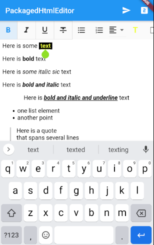

# enough_html_editor

Slim HTML editor for Flutter with full API control and optional Flutter-based widget controls.


## API Documentation
Check out the full API documentation at https://pub.dev/documentation/enough_html_editor/latest/

## Usage
The current `enough_html_editor` package the following widgets:
* `HtmlEditor` the HTML editor.
* `HtmlEditorControls` optional editor controls.
* `SliverHeaderHtmlEditorControls` wrapper to use the editor controls within a `CustomScrollView` as a sticky header. 
* `HtmlEditorApi` - not a widget - the API to control the editor, use the API to access the edited HTML text or to set the current text bold, add an unordered list, etc.
* `PackagedHtmlEditor` a simple to use Widget that contains both the `HtmlEditor` and the `HtmlEditorControls`

### Access API
You choose between two options to access the API:
1. Use the `onCreated(HtmlEditorApi)` callback:
    ```dart
    HtmlEditor(
        onCreated: (api) {
            setState(() {
            _editorApi = api;
            });
        },
        ...
    );
    ```
    You can then access the API afterwards directly, e.g.
    ```dart
    final text = await _editorApi.getText();
    ```

2. Define and assign a  `GlobalKey<HtmlEditorState>`:
    ```dart
    final _keyEditor = GlobalKey<HtmlEditorState>();
    Widget build(BuildContext context) {
        return HtmlEditor(
              key: _keyEditor,
              ...
        );
    }
    ```
    You can then access the `HtmlEditorState` via this `GlobalKey`:
    ```dart
    final text = await _keyEditor.currentState.api.getText();
    ```

Either the API or the global key is required for creating the `HtmlEditorControls`.

## Quick Start
Use the `PackagedHtmlEditor` for a quick start. This contains both the default controls and the editor.
```dart
HtmlEditorApi _editorApi;

@override
Widget build(BuildContext context) {
    return PackagedHtmlEditor(
          onCreated: (api) {
            _editorApi = api;
          },
          initialContent: '''<p>Here is some text</p>
          <p>Here is <b>bold</b> text</p>
          <p>Here is <i>some italic sic</i> text</p>
          <p>Here is <i><b>bold and italic</b></i> text</p>
          <p style="text-align: center;">Here is <u><i><b>bold and italic and underline</b></i></u> text</p>
          <ul><li>one list element</li><li>another point</li></ul>
          <blockquote>Here is a quote<br/>
            that spans several lines<br/>
            <blockquote>
                Another second level blockqote 
            </blockquote>
        </blockquote>
''',
        );
}
```

Use the `HtmlEditorApi` that you receive in the `onCreated` callback to query the final text:
```dart
// retrieve only the edited text as HTML code: 
final text = await _editorApi.getText();
// retrieve the full document as HTML code:
final fullHtml = await _editorApi.getFullHtml();
```

## Installation
Add this dependency your pubspec.yaml file:

```
dependencies:
  enough_html_editor: ^0.0.4
```
The latest version or `enough_html_editor` is [](https://pub.dartlang.org/packages/enough_html_editor).


## Features and bugs

Please file feature requests and bugs at the [issue tracker][tracker].

[tracker]: https://github.com/enough-software/enough_html_editor/issues

## License

Licensed under the commercial friendly [Mozilla Public License 2.0](LICENSE).